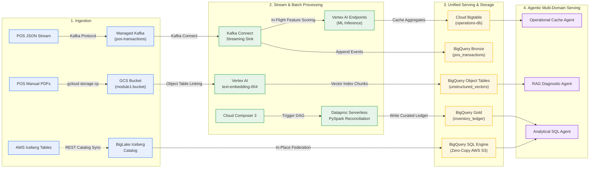
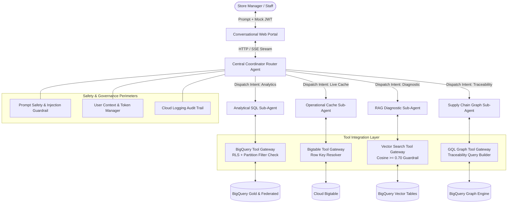
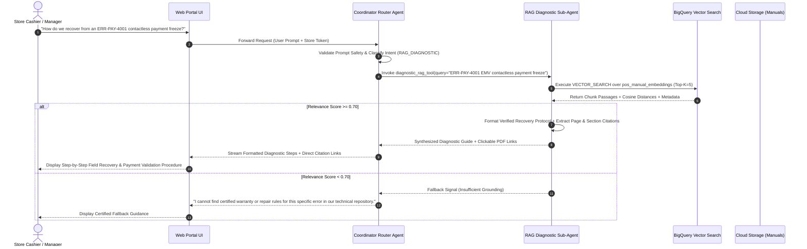
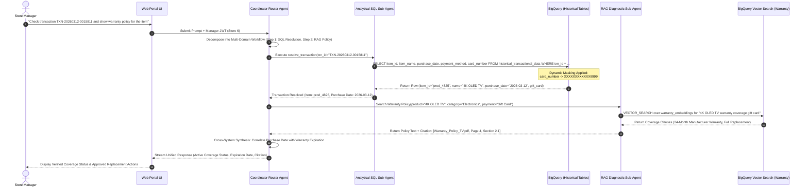
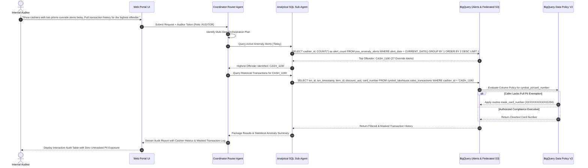
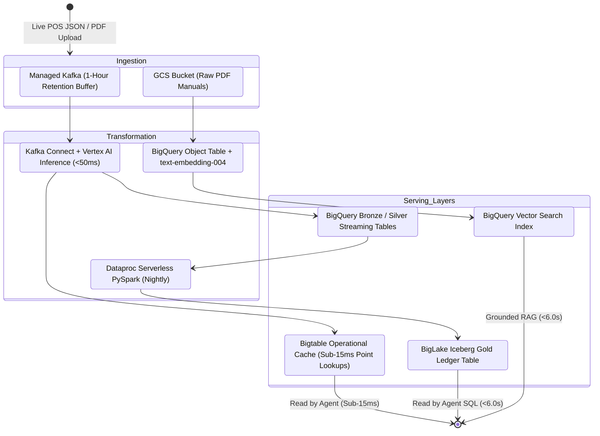
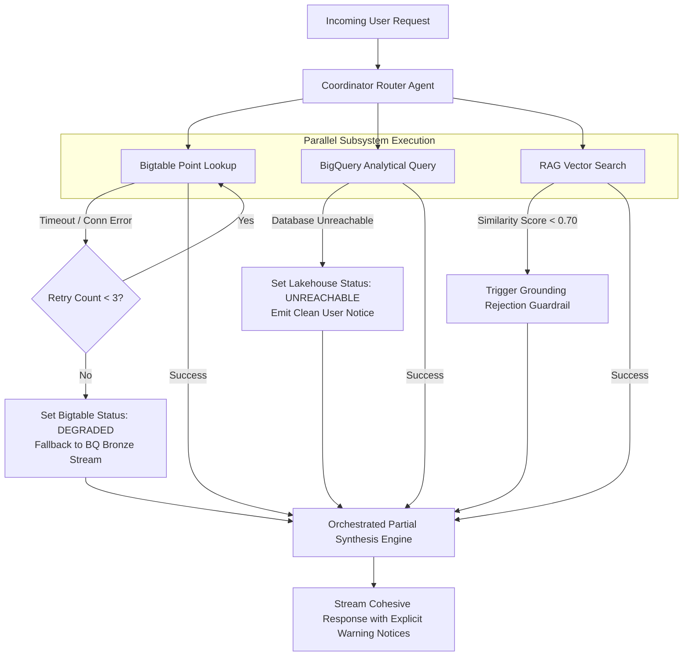
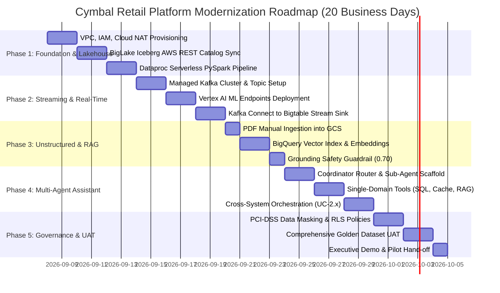

# SOLUTION DESIGN DOCUMENT (SDD)

# Document Control

## Document Metadata

| Field | Value |
| :---- | :---- |
| **Project Name** | Cymbal Retail — Agentic AI & Modern Data Platform Modernization |
| **Document Title** | Solution Design Document (SDD) & Reference Architecture Blueprint |
| **Author(s)** | Google Cloud Consulting Engineering & Cymbal Retail Joint Architecture Working Group |
| **Lead Architect** | Principal Cloud Solutions Architect (CE / Data & AI Specialist) |
| **Document Owner** | Chief Information Officer (CIO) & Director of Retail Data Engineering |
| **Creation Date** | 2026-09-08 |
| **Status** | Production-Ready Candidate / Approved for Pilot Implementation |
| **Target Audience** | Evaluation Committee, Lead Enterprise Architects, Data Platform Engineering, SecOps |
| **Document Version** | 1.1.0 |
| **Repository Path** | `docs/sdd.md` |

## Revision History

| Version | Date | Author | Description of Change |
| :--- | :--- | :--- | :--- |
| 0.1 | 2026-09-01 | Cloud Architecture Team | Initial solution design outline and requirements mapping |
| 0.9 | 2026-09-05 | Data & AI Platform Specialists | Incorporated Lakehouse Federation, Streaming Intelligence, and Agentic RAG |
| 1.0 | 2026-09-08 | Enterprise Solution Architect | Production-grade design: Added Draw.io architecture, Security Guardrails, FinOps, and UAT Rubric |
| 1.1 | 2026-09-08 | Enterprise Solution Architect | Incorporated Customer Review Feedback: Added structured Tabular Error-Handling Matrix with user-safe messaging (Section 5.2.1), formalized Enterprise IdP OIDC/WIF Claim Mappings (Section 4.3.1), and finalized AWS IAM Cross-Account Trust & Permissions Policies for BigLake (Section 4.5). |

---

# 1. Problem Statement & Scope Boundaries

## 1.1. Problem Statement

### What problem are we solving?
Cymbal Retail operates 500+ physical storefronts and a global e-commerce portal, generating millions of daily transactional events and thousands of operational documents. The current enterprise data architecture, anchored on AWS and Databricks, suffers from four acute architectural bottlenecks:
1. **Escalating Cross-Cloud Egress & Data Duplication**: Replicating data between AWS S3, regional store databases, and analytical environments incurs tens of thousands of dollars in monthly network egress costs and generates brittle, desynchronized reporting silos.
2. **High Cluster Overhead & Idle Tax**: Nightly inventory reconciliation and batch sales deduplication on Databricks clusters incur persistent infrastructure overhead and high idle compute charges ($0 idle compute is impossible under persistent cluster configurations).
3. **24-Hour Batch Reporting Latencies**: Operational store metrics and promotion override auditing lag by 24 hours. Store managers and checkout systems face inventory blind spots, leading to out-of-stock lost sales, inventory shrinkage, and undetected cashier promotional abuse at physical checkout lanes.
4. **Dark Data Trapped in Unstructured Formats**: Over 30 critical POS terminal hardware manuals and product warranty policy PDFs remain unindexed in cloud object storage, inaccessible to store-floor cashiers during payment terminal hardware freezes or warranty return disputes.
5. **Lack of Agentic Multi-Modal Self-Service**: Store managers and supply chain planners must navigate fragmented BI dashboards or wait on data engineering teams for ad-hoc SQL extracts, lacking an intuitive, multi-modal conversational assistant that can reason across structured tables, real-time telemetry streams, and unstructured technical manuals.

### Who is affected?
- **Store Managers (500+ locations)**: Lack real-time visibility into intraday store revenue, cashier override anomalies, and Available-to-Promise (ATP) shelf inventory.
- **Shop-Floor Cashiers & Support Techs**: Experience checkout register freezes (e.g., `ERR-PAY-4001`) with no instant, grounded diagnostic recovery guidance, causing customer checkout abandonment.
- **Regional Supply Chain Planners**: Face inaccurate inventory snapshots and cannot rapidly trace recalled supplier lots across distribution networks.
- **Internal Audit & Loss Prevention Teams**: Cannot identify cashier promotion abuse or fraudulent discounts until next-day batch auditing runs.
- **Data Engineering & Platform Operations**: Burdened with maintaining brittle ETL pipelines, managing complex Spark cluster sizing, and mitigating data privacy/PCI-DSS compliance exposure.

### What is the impact?
- **Financial Drag**: An estimated $120,000/year in unnecessary cross-cloud data egress fees, combined with over $450,000/year in idle cluster infrastructure spend.
- **Operational Shrinkage**: $2.4M in estimated annual retail shrinkage and promotional abuse leakage resulting from 24-hour auditing delays.
- **Customer Friction**: 45-minute average Mean Time to Resolution (MTTR) during store POS terminal lockups, directly degrading customer satisfaction and in-store conversion rates.
- **Compliance Exposure**: Heightened risk of regulatory fines under PCI-DSS due to unmasked payment card numbers appearing in ad-hoc query extracts and analytical logs.

### Why now?
With the upcoming Q4 retail peak volume and planned expansion into 100 new storefronts, Cymbal Retail cannot scale its existing monolithic batch architecture without compounding operational fragility and costs. Establishing an open, serverless, and agentic data platform on Google Cloud provides the immediate foundation for zero-copy lakehouse federation, sub-second operational stream intelligence, and AI-powered operational autonomy.

---

## 1.2. Scope Boundaries

### In Scope for Solution
- **Zero-Copy Cross-Cloud Lakehouse Federation**: In-place federated querying of AWS S3 Apache Iceberg tables via BigLake Iceberg REST Catalog linked to AWS Glue (`621785110540`), eliminating data egress and physical data movement.
- **Serverless PySpark Batch Processing**: Migration of nightly inventory normalization and sales reconciliation pipelines to Dataproc Serverless, auto-scaling compute dynamically and scaling to $0 when idle.
- **Streaming Intelligence & In-Flight ML Scoring**: Real-time ingestion of POS JSON transactions from 50 stores via Google Managed Service for Apache Kafka, sliding-window aggregations (1-hour window) in Kafka Connect/Dataflow, low-latency operational caching in Cloud Bigtable (`operations-db`), and in-flight inference (<50ms) via Vertex AI Online Prediction Endpoints.
- **Unstructured Document Ingestion & Grounded RAG**: Automated indexing of PDF POS technical repair manuals and product warranty policies into Google Cloud Storage, BigQuery Object Tables, Vertex AI Embeddings (`text-embedding-004`), and BigQuery Vector Search with a strict 0.70 cosine similarity grounding guardrail and clickable source citations.
- **Autonomous Multi-Agent Conversational Portal**: A unified web-based chat application powered by an Agentic Architecture consisting of a Coordinator Router Agent, Analytical SQL Sub-Agent (with Central Business Glossary and partition pruning enforcement), Operational Cache Sub-Agent, RAG Diagnostic Sub-Agent, and Supply Chain Graph Sub-Agent.
- **Enterprise Security, Privacy & Governance**: Dynamic PCI-DSS payment card masking (`mask_card_number` routine `XXXXXXXXXXXX9999`) enforced via BigQuery Data Policy V2, Dataplex Knowledge Catalog certification tags (`certified = true`), delegated mock JWT end-user identity propagation for Row-Level Security (RLS) by `store_id`, and full Cloud Audit Logging.

### Out of Scope for Solution (Pilot Phase)
- **Direct Multi-Cloud Write-Backs**: All federated connections to AWS S3 and regional store operational databases are strictly read-only; no data modifications are pushed back to legacy AWS infrastructure.
- **Multi-Lingual & Voice / Telephony Interfaces**: Support is strictly limited to English textual chat; IVR, VoIP, and telephony voice-streaming adapters are excluded.
- **Production Enterprise Identity Provider Sync**: Production Okta / Active Directory LDAP federation is excluded; the pilot leverages functional GCP test service accounts, IAM roles, and mock JWT identity tokens passed in HTTP request headers.
- **Physical Register Hardware Deployment**: In-store POS terminal hardware firmware updates are excluded; an automated Compute Engine POS Event Load Generator VM simulates live register JSON streams (0.4 to 10 msg/sec).

---

## 1.3. Target Architecture Overview

The target solution establishes an end-to-end, multi-tiered enterprise architecture built natively on Google Cloud. It unifies distributed batch data, live event streams, unstructured knowledge repositories, and an autonomous multi-agent orchestration fabric into a single cohesive platform.

### Architecture Reference Diagram

The reference architecture is formally rendered below and available in high-resolution JPG format at [docs/assets/architecture.jpg](file:///usr/local/google/home/alexgcp/lab-da-c3-group-3/elevate-da-adv-day1/docs/assets/architecture.jpg), with source models in Draw.io format at [docs/assets/architecture.drawio](file:///usr/local/google/home/alexgcp/lab-da-c3-group-3/elevate-da-adv-day1/docs/assets/architecture.drawio):

```mermaid
flowchart TB
    subgraph S1["1. Data Sources & Ingestion Layer"]
        POS_Real["Store POS Registers<br/>(500+ Store Locations)"]
        POS_Sim["POS Event Generator VM<br/>(0.4 - 10 msg/sec)"]
        AWS_S3["AWS S3 Bucket<br/>(Iceberg Dims & Facts)"]
        AWS_Glue["AWS Glue Data Catalog<br/>(REST Metastore: 621785110540)"]
        PDF_Source["Dark Data Sources<br/>(32 PDF Manuals & Warranties)"]
    end

    subgraph S2["2. Streaming Intelligence & Low-Latency Serving"]
        MKafka["Managed Apache Kafka<br/>(pos-transactions / 5 partitions)"]
        KConnect["Managed Kafka Connect<br/>(Sliding 1-Hr Aggregations)"]
        Vertex_ML["Vertex AI Online Prediction<br/>(order-anomaly & cashier-abuse / <50ms)"]
        Bigtable["Cloud Bigtable: operations-db<br/>(RowKey: store_id#cashier_id#ts)"]
    end

    subgraph S3["3. Batch Lakehouse & Orchestration"]
        Composer["Cloud Composer 3 (Airflow)<br/>(cymbal-airflow-env)"]
        Dataproc["Dataproc Serverless PySpark<br/>(Nightly Inventory Reconciliation)"]
        BigLake_Cat["BigLake Iceberg REST Catalog<br/>(cymbal-lakehouse / 300s sync)"]
        GCS_Stage["GCS Staging Bucket<br/>(gs://module1-bucket)"]
    end

    subgraph S4["4. BigQuery Unified Analytics & Vector Engine"]
        BQ_Bronze["cymbal_bronze<br/>(Raw Streaming POS)"]
        BQ_Silver["cymbal_silver<br/>(Conformed Events)"]
        BQ_Gold["cymbal_gold<br/>(Ledger, Historical TXN, ML Models)"]
        BQ_Object["module1_unstructureddata<br/>(Object Table & Vector Index)"]
        BQ_Graph["Enterprise Slot Reservation<br/>(GQL Graph Engine: 200 Slots)"]
        Data_Mask["Data Policy V2 & Governance<br/>(mask_card_number / cymbal_pii)"]
    end

    subgraph S5["5. Agentic AI & Conversational Serving Portal"]
        Web_UI["Store Operations Web Portal<br/>(Streamlit / React Conversational UI)"]
        Router["Central Coordinator Router Agent<br/>(Intent Classification & Prompt Guardrails)"]
        SQL_Agent["Analytical SQL Sub-Agent<br/>(Text-to-SQL + Business Glossary)"]
        Cache_Agent["Operational Cache Sub-Agent<br/>(Bigtable Sub-15ms Point Lookups)"]
        RAG_Agent["RAG Diagnostic Sub-Agent<br/>(BQ Vector Search / Cosine >= 0.7)"]
        Graph_Agent["Supply Chain Graph Sub-Agent<br/>(GQL Recalls & Lot Traceability)"]
    end

    %% Data Flow Connections
    POS_Real -->|JSON Telemetry| MKafka
    POS_Sim -->|Synthetic Checkout| MKafka
    MKafka -->|Stream Ingestion| KConnect
    KConnect -->|In-Flight Feature Scoring| Vertex_ML
    Vertex_ML -->|Anomaly Flags & Alerts| Bigtable
    KConnect -->|Micro-batch Ingestion| BQ_Bronze

    AWS_S3 -.->|Zero-Copy Read| BigLake_Cat
    AWS_Glue -.->|Metadata Synchronization| BigLake_Cat
    BigLake_Cat -->|Federated Analytical Queries| BQ_Gold

    Composer -->|Trigger Batch Pipeline| Dataproc
    Dataproc -->|Write Reconciled Parquet| GCS_Stage
    GCS_Stage -->|External Iceberg Table| BQ_Gold

    PDF_Source -->|Staged Upload| GCS_Stage
    GCS_Stage -->|Object Table Manifest| BQ_Object

    Web_UI -->|Natural Language Prompt + Mock JWT| Router
    Router -->|Analytical Query Request| SQL_Agent
    Router -->|Point Lookup Request| Cache_Agent
    Router -->|Hardware / Warranty Diagnostic| RAG_Agent
    Router -->|Lot Traceability Query| Graph_Agent

    SQL_Agent -->|SQL Query + RLS Token Filter| BQ_Gold
    Cache_Agent -->|Row Key Scan| Bigtable
    RAG_Agent -->|VECTOR_SEARCH & Metadata| BQ_Object
    Graph_Agent -->|GQL Match Query| BQ_Graph

    BQ_Gold -.->|Dynamic PCI-DSS Masking| Data_Mask
    Data_Mask -.->|Masked Results| SQL_Agent

    classDef gcpBlue fill:#e8f0fe,stroke:#4285f4,stroke-width:2px;
    classDef gcpGreen fill:#e6f4ea,stroke:#34a853,stroke-width:2px;
    classDef gcpYellow fill:#fef7e0,stroke:#fbbc04,stroke-width:2px;
    classDef gcpRed fill:#fce8e6,stroke:#ea4335,stroke-width:2px;
    classDef gcpPurple fill:#f3e8fd,stroke:#9334e6,stroke-width:2px;

    class POS_Real,POS_Sim,AWS_S3,AWS_Glue,PDF_Source gcpBlue;
    class MKafka,KConnect,Vertex_ML,Bigtable gcpGreen;
    class Composer,Dataproc,BigLake_Cat,GCS_Stage gcpRed;
    class BQ_Bronze,BQ_Silver,BQ_Gold,BQ_Object,BQ_Graph,Data_Mask gcpYellow;
    class Web_UI,Router,SQL_Agent,Cache_Agent,RAG_Agent,Graph_Agent gcpPurple;
```




### Component Descriptions

| Component | Responsibility | Proposed Technology | Interfaces / Protocols |
| :--- | :--- | :--- | :--- |
| **POS Stream Ingestion** | Ingest real-time JSON checkout transactions from 50 store locations with zero message loss and ordered partitioning. | Managed Service for Apache Kafka (`kafka-cluster`) | Kafka Binary Protocol, TLS, SASL/Plain over Private VPC Subnet (`10.10.0.0/22`) |
| **Streaming Aggregation & Pipeline** | Execute 1-hour sliding-window aggregations on cashier promotion overrides and stream records into BigQuery and Bigtable. | Managed Kafka Connect (`kafka-connect-cluster`) / Cloud Dataflow | Kafka Connect API, Bigtable gRPC, BigQuery Storage Write API |
| **In-Flight ML Inference** | Evaluate live transactions against trained fraud and anomaly models with sub-50ms latency. | Vertex AI Online Prediction Endpoints (`cashier-abuse-endpoint`, `order-anomaly-endpoint`) | REST / gRPC HTTPS (`predict` API endpoint) |
| **Operational Caching Layer** | Provide sub-15ms P99 point lookups for active store alerts, cashier override statistics, and fraud indicators. | Cloud Bigtable (`operations-db`, cluster `operations-cluster`) | Bigtable gRPC API (`ReadRows`, `MutateRow`) |
| **Cross-Cloud Lakehouse Federation** | Enable zero-copy federated queries over historical dimension and fact tables stored on AWS S3 without data egress. | BigLake Iceberg REST Catalog (`cymbal-lakehouse`) linked to AWS Glue | BigLake REST API, AWS STS AssumeRoleWithWebIdentity, Iceberg Metadata Spec v2 |
| **Serverless Batch ETL** | Perform nightly inventory stock reconciliation across 500+ stores, normalizing counts and scaling compute to $0 when idle. | Dataproc Serverless PySpark (Runtime 2.2) | Spark Submit CLI / REST API, Cloud Storage Connector, BigLake Connector |
| **Batch Pipeline Orchestration** | Schedule, orchestrate, and monitor end-to-end nightly data pipelines, validation checks, and ledger table refreshes. | Cloud Composer 3 (`cymbal-airflow-env`, Airflow 2.10.5) | Airflow DAGs (Python), Cloud Logging, Cloud Monitoring |
| **Unified Analytics & Vector Fabric** | Store curated gold facts, execute vectorized analytical queries, run GQL graph queries, and host text vector embeddings. | BigQuery (Enterprise Edition Slot Reservation `gql-query-reservation`, 200 autoscaling slots) | BigQuery SQL / GQL, `VECTOR_SEARCH` routine, BigQuery REST API |
| **Unstructured Knowledge Repository** | Stage and parse 32 POS equipment manuals and warranty policy documents, extracting text chunks and vector embeddings. | Cloud Storage (`gs://${PROJECT_ID}-module1-bucket`), BigQuery Object Tables, Vertex AI `text-embedding-004` | GCS HTTPS API, BigQuery Cloud Resource Connection (`biglake-iceberg-connection`) |
| **AI Governance & PII Masking** | Manage enterprise metadata, certify trustworthy datasets, and dynamically redact sensitive payment card numbers (PCI-DSS). | Dataplex / Knowledge Catalog, BigQuery Data Policy V2 (`mask_card_number_mod3`) | Google Cloud Resource Manager Tags (`cymbal_pii/card_number`), SQL Masking Routines |
| **Coordinator Router Agent** | Receive end-user queries, enforce prompt safety guardrails, isolate multi-turn session state, route to sub-agents, and synthesize partial outputs. | Google Agent Development Kit (ADK) / Vertex AI Agent Framework | HTTP REST JSON, SSE (Server-Sent Events) for real-time response streaming |
| **Specialized Domain Sub-Agents** | Execute domain-specific reasoning (SQL generation, Bigtable key lookups, manual vector search, supply chain graph queries). | Specialized ADK Agent Workers with structured tool call definitions | Python Function Calling, MCP (Model Context Protocol) tool connectors |

---

## 1.4. Alternatives Considered & Architectural Decision Matrix

To ensure technical rigor, every core architectural component was benchmarked against alternative Google Cloud offerings and competing cloud solutions:

| Architecture Decision / Area | Alternative Evaluated | Chosen Approach | Rationale & Trade-offs |
| :--- | :--- | :--- | :--- |
| **Cross-Cloud Data Federation** | **AWS Egress Physical Replication (S3 -> GCS via STS)** | **BigLake Iceberg REST Catalog Federation** | **Why Chosen:** BigLake federated querying provides zero-copy querying directly over AWS S3 Iceberg tables without physical file transfers, eliminating estimated $10,000/mo AWS data egress fees and avoiding duplicate storage costs.<br>**Trade-off:** Query execution over cross-cloud network links adds modest scan latency compared to local GCS reads, which is mitigated by Iceberg partition pruning and BigQuery vectorized acceleration. |
| **Batch Inventory Reconciliation** | **Persistent Databricks on AWS / Persistent Dataproc on GCE** | **Dataproc Serverless PySpark** | **Why Chosen:** Serverless PySpark dynamically provisions compute per job execution and scales strictly to $0 upon completion. Eliminates 24/7 idle cluster costs ($450K/yr savings) and cluster management toil.<br>**Trade-off:** Cold-start provisioning latency (~45-60 seconds) is negligible for scheduled nightly batch reconciliation runs. |
| **Operational Caching Layer** | **Cloud SQL (PostgreSQL) / Memorystore for Redis** | **Cloud Bigtable (`operations-db`)** | **Why Chosen:** Bigtable natively scales horizontally to millions of write operations with guaranteed single-digit millisecond latency (P99 < 15ms), handling massive bursts from 500+ store POS terminals without connection pool exhaustion.<br>**Trade-off:** Requires careful row key design (`store_id#cashier_id#reverse_ts`) and lacks multi-table JOIN support, which is delegated to BigQuery. |
| **Unstructured Document Vector Search** | **Dedicated External Vector DB (e.g., Pinecone, Milvus)** | **BigQuery Object Tables + Native `VECTOR_SEARCH`** | **Why Chosen:** Colocates unstructured vector embeddings with existing enterprise transactional tables in BigQuery. Eliminates external synchronization pipelines, leverages existing IAM and Dataplex security perimeters, and allows unified SQL queries combining structured customer data with unstructured warranty chunks.<br>**Trade-off:** Sub-second vector search latency is slightly higher than in-memory specialized vector engines (e.g., ~1.2s vs ~150ms), well within the 6.0s conversational SLA. |
| **Streaming Messaging Backbone** | **Self-Managed Apache Kafka on GCE / Pub/Sub** | **Google Managed Service for Apache Kafka** | **Why Chosen:** Provides 100% standard Kafka protocol compatibility for existing retail POS edge clients without operational burden of managing ZooKeeper/KRaft broker nodes. Native private VPC integration with Kafka Connect.<br>**Trade-off:** Higher minimum managed infrastructure cost than basic serverless Pub/Sub, but required for legacy POS client compatibility and stateful Kafka Connect stream joins. |
| **Agent Orchestration Framework** | **Monolithic Single-Prompt LLM (Direct SQL/API tool dump)** | **Multi-Agent Coordinator Architecture (ADK)** | **Why Chosen:** Decomposing complex tasks into specialized sub-agents (SQL, Bigtable, RAG, Graph) eliminates tool confusion, ensures strict grounding guardrails (rejecting RAG chunks < 0.70), enforces deterministic security token propagation, and enables parallel tool execution for cross-system use cases.<br>**Trade-off:** Requires state synchronization and routing latency overhead (~300ms routing overhead), mitigated by streaming response tokens. |
| **Supply Chain Graph Engine** | **External Graph Database (Neo4j / Amazon Neptune)** | **BigQuery Graph (GQL) with Enterprise Reservation** | **Why Chosen:** BigQuery natively supports ISO GQL (Graph Query Language) over existing relational supplier, lot, and sales tables without ETL duplication. Autoscaling Enterprise slots (up to 200) ensure high-throughput batch graph traversals.<br>**Trade-off:** Graph queries require Enterprise Edition slot assignment (`gql-query-assignment`), which is already provisioned for analytical workloads. |

---

# 2. Production-Ready Future State Design

## 2.1. Future Extensibility & Modularity
The platform is engineered around open standards to prevent vendor lock-in and accommodate future enterprise evolution:
- **Open Table Formats**: All core batch data rests in Apache Iceberg v2 format, allowing seamless interoperability across BigQuery, Apache Spark, Trino, and DuckDB.
- **Model Context Protocol (MCP) & Pluggable Agent Tools**: Sub-agent integrations leverage standard function calling interfaces that can be wrapped as Model Context Protocol (MCP) microservices. Adding new operational capabilities (e.g., automated inventory reordering or SAP ERP synchronization) requires registering a new tool contract without altering the core Coordinator Router logic.
- **Open Catalog Standards**: BigLake Iceberg REST Catalog exposes standard Iceberg REST endpoints, permitting future multi-cloud catalog federation to Databricks Unity Catalog, Snowflake Horizon, or Apache Polaris.

## 2.2. Scalability Architecture
The platform is designed to scale dynamically from pilot workloads to enterprise production scale (500+ stores, 10,000+ POS registers):
- **Store Manager Peak Concurrency**: At 9:00 AM local store opening, over 500 store managers concurrently query morning flash reports and inventory cover hours. BigQuery autoscaling slots (configured with an Enterprise Edition reservation scaling to 200 slots) dynamically accommodate query concurrency spikes without manual intervention or queuing delays.
- **Streaming Ingestion Throughput**: Managed Kafka cluster is provisioned with 5 partitions and replication factor 3, supporting throughput increases from pilot loads (0.4 to 10 msg/sec) to production peak volumes (5,000+ msg/sec) simply by adjusting partition counts and broker capacity configurations.
- **Operational Cache Horizontal Scaling**: Cloud Bigtable instance (`operations-db`) is configured with SSD storage and auto-scaling capabilities. While provisioned with 1 node for the pilot, production deployment enables horizontal autoscaling up to 30 nodes based on CPU utilization (>65%) and storage targets.

## 2.3. High Availability & Disaster Recovery (HA/DR)
- **Zero Data Loss Streaming**: Kafka topic `pos-transactions` enforces a replication factor of 3 across distinct availability zones, ensuring zero data loss in the event of single-zone infrastructure failure.
- **Storage Durability**: GCS buckets and BigQuery storage provide 99.999999999% (11 9's) annual durability with regional replication across multiple zones.
- **Managed Orchestration Resilience**: Cloud Composer 3 environment (`cymbal-airflow-env`) runs on a fully managed, multi-zone Kubernetes architecture with automatic worker restart, metadata backup, and automated scheduler failover.
- **Target RTO / RPO**:
  - *Recovery Time Objective (RTO)*: < 15 minutes for analytical query fabric; < 2 minutes for operational Bigtable cache.
  - *Recovery Point Objective (RPO)*: RPO = 0 for streaming POS transactions (durable Kafka commit); RPO < 5 minutes for federated Iceberg metadata synchronization.

## 2.4. Operational Readiness, Telemetry & SRE
- **Unified Observability**: All platform components export health metrics and telemetry to Google Cloud Monitoring. Pre-configured alert policies trigger on:
  - Kafka consumer group lag > 5,000 messages.
  - Vertex AI prediction endpoint P95 latency > 100ms.
  - Bigtable CPU utilization > 70% sustained for 5 minutes.
  - BigQuery query slot contention or quota exhaustion.
- **Audit Logging & Tracing**: Every end-user conversational interaction, router dispatch decision, generated SQL statement, and vector similarity score is logged to Cloud Logging with Cloud Trace distributed tracing spans, enabling end-to-end debugging and compliance audits.

---

# 3. System Flows, Sequence Diagrams & Agent Design

## 3.1. End-to-End Data Value Pattern

The following flowchart details how raw transactional data, unstructured technical documents, and remote lakehouse assets flow through transformation layers into actionable operational insights:



---

## 3.2. Agent Interaction & Orchestration Architecture

The Cymbal Retail conversational assistant is architected as an autonomous multi-agent hierarchy orchestrated by a Central Coordinator Router Agent:



### Coordinator Router Agent Responsibilities:
1. **Prompt Sanitization & Security Guardrails**: Inspects inbound user prompts for prompt injection, jailbreak patterns, or malicious SQL commands prior to invoking downstream tools.
2. **Intent Classification & Routing**: Classifies user queries into single-domain tasks (SQL analytics, cache lookup, RAG troubleshooting) or multi-domain orchestration workflows.
3. **Session State Isolation**: Maintains multi-turn dialog memory within isolated session containers (keyed by `session_id`), preventing memory cross-contamination across concurrent store manager logins.
4. **Token Propagation**: Extracts identity metadata (e.g., `store_id = "STORE_008"`, `role = "STORE_MANAGER"`) from the caller's JWT token and injects these parameters into every sub-agent tool invocation.
5. **Partial Synthesis on Subsystem Failure**: In multi-system cross-domain flows, if an individual subsystem times out or fails (e.g., a regional database disconnect), the router synthesizes a partial response containing available data and explicitly notes the unavailable subsystem without raising an unhandled exception.

---

## 3.3. Detailed Sequence Diagrams for Core Use Cases

### Sequence 1: Single-Domain RAG & Diagnostic Hardware Troubleshooting (UC-1.1)
*Cashier terminal encounters `ERR-PAY-4001` EMV contactless payment freeze.*



### Sequence 2: Multi-Domain Customer Warranty Triage (UC-2.1)
*Customer returns an item purchased with a gift card; cashier requests warranty status.*



### Sequence 3: Multi-Domain Cashier Promotion Abuse Audit with Dynamic PII Masking (UC-2.3)
*Loss Prevention Auditor queries active promotion override alerts and examines transaction history.*



---

# 4. Data Platform Architecture, Security & Governance

## 4.1. Entity Definitions & Schemas

### 1. Gold Inventory Reconciliation Ledger (`cymbal_gold.gold_inventory_reconciliation_ledger`)
- **Format**: BigLake Iceberg Managed Table linked to `gs://${PROJECT_ID}-module1-bucket/gold_inventory_reconciliation_ledger/`
- **Partitioning / Clustering**: Clustered by `reconciliation_status`, `store_id`
- **Schema**:
  ```sql
  CREATE TABLE cymbal_gold.gold_inventory_reconciliation_ledger (
    business_date DATE,
    store_id STRING,
    store_name STRING,
    city STRING,
    item_id STRING,
    unit_price_usd FLOAT64,
    opening_qty INT64,
    shelf_qty INT64,
    backroom_qty INT64,
    intraday_gross_revenue_usd FLOAT64,
    est_cover_hours_remaining FLOAT64,
    reconciliation_status STRING
  )
  CLUSTER BY reconciliation_status, store_id;
  ```

### 2. Historical Retail Transactions (`cymbal_gold.historical_transactional_data`)
- **Format**: BigQuery Native Storage Table (22,390 rows seeded for pilot evaluation)
- **Governance**: Policy Tag `cymbal_pii/card_number` applied to `card_number` column
- **Schema**:
  ```sql
  CREATE TABLE cymbal_gold.historical_transactional_data (
    txn_id STRING,
    store_id STRING,
    pos_terminal_id STRING,
    cashier_id STRING,
    customer_id STRING,
    card_number STRING OPTIONS(data_governance_tags=[("${PROJECT_ID}/cymbal_pii", "card_number")]),
    txn_timestamp TIMESTAMP,
    item_id STRING,
    quantity INT64,
    unit_price_usd FLOAT64,
    discount_applied_usd FLOAT64,
    total_amount_usd FLOAT64,
    payment_method STRING
  );
  ```

### 3. Operational Cache Schema (Cloud Bigtable: `operations-db`)
- **Table Name**: `cashier_hourly_stats`
- **Column Family**: `cf_metrics` (Max Versions: 1, GC Rule: TTL 7 Days)
- **Row Key Design**: `store_id#cashier_id#reverse_timestamp`
  - *Example*: `STORE_008#CASH_1190#922337031854775807`
  - *Rationale*: Pre-splitting by `store_id` guarantees uniform tablet distribution across Bigtable cluster nodes; reverse timestamp enables low-latency scanning of latest intra-day transactions.
- **Stored Column Qualifiers**:
  - `cf_metrics:hourly_override_count` (int64)
  - `cf_metrics:hourly_discount_total_usd` (float64)
  - `cf_metrics:active_fraud_flag` (boolean)
  - `cf_metrics:last_alert_code` (string)

### 4. Unstructured Document Chunks & Vector Store (`module1_unstructureddata`)
- **Object Table**: Maps directly to PDF files stored in `gs://${PROJECT_ID}-module1-bucket/`
- **Embedding Table**: `module1_unstructureddata.document_embeddings`
  - `doc_id` STRING (Unique document identifier)
  - `doc_name` STRING (Filename, e.g., `POS_Terminal_ModelX_FieldManual.pdf`)
  - `doc_category` STRING (`POS_MANUAL` or `WARRANTY_POLICY`)
  - `page_number` INT64 (Extracted page number)
  - `section_header` STRING (Section title or error code header)
  - `content_chunk` STRING (Text chunk passage, ~500 tokens)
  - `embedding` ARRAY<FLOAT64> (768-dimensional vector from `text-embedding-004`)
  - `source_uri` STRING (`gs://...` authenticated object link)

---

## 4.2. Data Lifecycle & Ingestion Pipelines



1. **Streaming Lifecycle**:
   - Ingested POS transactions are written to `pos-transactions` in Kafka.
   - Kafka Connect applies sliding-window aggregations and invokes Vertex AI prediction endpoints for in-flight fraud scoring.
   - Anomalies are immediately written to Bigtable (`operations-db`) for instant retrieval (<15ms) and appended to BigQuery `cymbal_bronze` via BigQuery Storage Write API.
2. **Nightly Batch Lifecycle**:
   - Cloud Composer 3 triggers a scheduled DAG at 01:00 AM UTC.
   - Dataproc Serverless executes PySpark reconciliation, normalizing store POS dumps against warehouse inventory counts.
   - Reconciled records are written to Cloud Storage in Iceberg Parquet format, updating `cymbal_gold.gold_inventory_reconciliation_ledger`. Compute scales to $0 upon completion.
3. **Unstructured Document Lifecycle**:
   - Technical PDFs uploaded to GCS are automatically detected by BigQuery Object Tables.
   - Vertex AI text embedding models generate 768-dimensional embeddings for chunked passages.
   - BigQuery maintains an active Vector Index for cosine similarity search.

---

## 4.3. Identity, Access Control & Row-Level Security

The platform enforces strict Principle of Least Privilege across all tiers:
- **Dedicated Service Accounts**:
  - `cymbal-sa-data@${PROJECT_ID}.iam.gserviceaccount.com`: Core pipeline identity provisioned with BigLake Admin, BigQuery Admin, Dataproc Worker, and Storage Object User roles.
  - `sa-data-lead`: Full administrative read/write and policy administration.
  - `sa-analyst`: Read-only analytical access with dynamic masking applied.
  - `sa-restricted`: Restricted access persona for negative testing.
- **Delegated End-User Token Propagation**:
  The web UI passes the caller's verified mock JWT token in the HTTP `Authorization: Bearer <token>` header. The Coordinator Router extracts:
  - `user_id`: Unique employee ID (e.g., `MGR_042`)
  - `store_id`: Assigned retail store (e.g., `STORE_008`)
  - `role`: `STORE_MANAGER`, `DISTRICT_PLANNER`, or `COMPLIANCE_AUDITOR`
- **Row-Level Security (RLS) Policy**:
  BigQuery applies dynamic Row Access Policies to restrict store managers to their own store's data:
  ```sql
  CREATE OR REPLACE ROW ACCESS POLICY store_manager_row_filter
  ON cymbal_gold.gold_inventory_reconciliation_ledger
  GRANT TO ("group:store-managers@cymbalretail.com", "serviceAccount:cymbal-sa-data@${PROJECT_ID}.iam.gserviceaccount.com")
  FILTER USING (
    SESSION_USER() = 'auditor@cymbalretail.com' 
    OR store_id = @token_store_id
  );
  ```

### 4.3.1. Production Enterprise Identity Provider (IdP) Integration & Claim Mapping Specification

To transition seamlessly from the pilot phase mock tokens to enterprise production authentication, Cymbal Retail will deploy **Google Cloud Workforce Identity Federation (WIF)** combined with OpenID Connect (OIDC) / OAuth 2.0. This allows 500+ store managers, regional district planners, and compliance auditors to authenticate directly against their corporate IdP (**Okta**, **Microsoft Entra ID / Azure AD**, or **PingFederate**) without synchronizing passwords or creating permanent service account keys.

#### Enterprise IdP Claim Mapping Matrix

The table below defines the exact claim transformation rules from the enterprise IdP token to Google Cloud Workforce Identity attributes and downstream platform bindings:

| Enterprise IdP Claim (Okta / Entra ID) | Standard OIDC / JWT Claim | Google Cloud WIF Attribute Mapping | Target Platform Binding & Enforcement Point | Data Type & Format Constraint | Production Example Value |
| :--- | :--- | :--- | :--- | :--- | :--- |
| `sub` | `sub` (Subject) | `google.subject` | Unique enterprise employee ID; maps to Agent Session memory isolation key and immutable Cloud Audit Logs. | `STRING` (Unique alphanumeric) | `"cymbal-emp-849201"` |
| `email` / `upn` | `email` | `attribute.user_email` | Mapped to BigQuery `SESSION_USER()` and notification webhook destinations. | `STRING` (RFC 5322 format) | `"jdoe@cymbalretail.com"` |
| `custom:store_number` / `extension_StoreId` | `store_id` | `attribute.store_id` | **Directly evaluated in BigQuery Row Access Policies (`@user_store_id`)** to enforce geographic store data boundaries. | `STRING` (`STORE_[0-9]{3}`) | `"STORE_008"` |
| `groups` / `roles` | `groups` | `attribute.roles` | IAM Role Binding & Dataplex Policy Tag access: Grants or restricts access to PCI-DSS masked vs. unmasked columns. | `ARRAY<STRING>` | `["STORE_MANAGERS", "INVENTORY_APPROVERS"]` |
| `department` | `department` | `attribute.department` | Injected into Coordinator Router context to tailor specialized tool permissions and analytical response schemas. | `STRING` | `"Store_Operations_West"` |
| `custom:clearance_level` | `clearance` | `attribute.clearance` | Evaluated against BigQuery Data Policy V2; required for exemption from payment card redaction. | `STRING` (`STANDARD`, `AUDIT`, `RESTRICTED`) | `"STANDARD"` |
| `iss` | `iss` (Issuer) | `google.issuer` | Validated against corporate IdP tenant URL; ensures requests originate exclusively from the authorized enterprise IdP. | `STRING` (HTTPS URI) | `"https://cymbal.okta.com/oauth2/default"` |
| `aud` | `aud` (Audience) | `google.audience` | Validated by Agent Gateway to prevent cross-service token replay attacks. | `STRING` (Audience URI) | `"https://api.cymbalretail.com/agentic-portal"` |
| `exp` | `exp` (Expiration) | Validated at Gateway | Rejection threshold: Tokens expired by > 0 seconds (with 30-second clock skew tolerance) are rejected immediately. | `INT64` (Unix epoch seconds) | `1773043200` (1-hour TTL) |

#### Sample Decoded Production JWT Payloads

##### Persona 1: Store Manager (Restricted Store Data Boundary)
```json
{
  "iss": "https://cymbal.okta.com/oauth2/default",
  "sub": "cymbal-emp-849201",
  "aud": "https://api.cymbalretail.com/agentic-portal",
  "iat": 1773039600,
  "exp": 1773043200,
  "name": "Jane Doe",
  "email": "jdoe@cymbalretail.com",
  "custom:store_number": "STORE_008",
  "department": "Store_Operations_West",
  "groups": ["STORE_MANAGERS", "INVENTORY_APPROVERS"],
  "custom:clearance_level": "STANDARD"
}
```

##### Persona 2: Compliance Auditor (Unmasked PCI-DSS Reader)
```json
{
  "iss": "https://cymbal.okta.com/oauth2/default",
  "sub": "cymbal-emp-103982",
  "aud": "https://api.cymbalretail.com/agentic-portal",
  "iat": 1773039600,
  "exp": 1773043200,
  "name": "Marcus Vance",
  "email": "mvance@cymbalretail.com",
  "custom:store_number": "GLOBAL",
  "department": "Internal_Audit_SecOps",
  "groups": ["COMPLIANCE_AUDITORS", "PCI_DATA_OFFICERS"],
  "custom:clearance_level": "AUDIT"
}
```

#### Token Lifecycle, Validation & Dynamic Policy Integration
1. **JWKS Asymmetric Key Rotation**: The Agent Gateway retrieves and caches the IdP’s JSON Web Key Set (JWKS) via `https://cymbal.okta.com/oauth2/default/v1/keys` using standard RS256/ES256 signature verification. Keys are cached with a 1-hour TTL and refreshed automatically upon signature miss.
2. **Production Workforce Identity Row-Level Security DDL**:
   ```sql
   -- Production Row Access Policy using Workforce Identity Attributes
   CREATE OR REPLACE ROW ACCESS POLICY store_manager_wif_filter
   ON cymbal_gold.gold_inventory_reconciliation_ledger
   GRANT TO ("principalSet://iam.googleapis.com/locations/global/workforcePools/cymbal-pool/group/STORE_MANAGERS")
   FILTER USING (
     SESSION_USER() IN (SELECT email FROM cymbal_governance.compliance_auditors)
     OR store_id = SESSION_USER_ATTRIBUTE("attribute.store_id")
   );
   ```

---

## 4.4. Data Privacy, PCI-DSS Masking & Governance

### Dynamic Column Masking Routine
To comply with PCI-DSS guidelines, customer credit and debit card numbers are masked at query runtime across all conversational interfaces, query logs, and BI reporting tools.

1. **Custom SQL Masking Function**:
   ```sql
   CREATE OR REPLACE FUNCTION cymbal_gold.mask_card_number(val STRING) 
   RETURNS STRING AS (
     CASE 
       WHEN val IS NULL OR val = 'NA' THEN 'NA'
       ELSE CONCAT('XXXXXXXXXXXX', SUBSTR(val, -4))
     END
   );
   ```

2. **Google Resource Tag Definition & Policy Binding**:
   - Tag Key: `${PROJECT_ID}/cymbal_pii`
   - Tag Value: `card_number`
   - Data Policy V2: `mask_card_number_mod3` binds the `mask_card_number` scalar routine to the `card_number` tag value.
   - Any query executing against `historical_transactional_data` automatically redacts card numbers (e.g., `4111-2222-3333-9876` becomes `XXXXXXXXXXXX9876`) unless the principal possesses the explicit `roles/bigquery.maskedReader` entitlement.

3. **AI Safety & Grounding Guardrails**:
   - **Grounded RAG Guardrail**: The RAG Diagnostic Sub-Agent calculates cosine similarity distance for all candidate text chunks. If the highest similarity score is strictly below **0.70**, the agent immediately declines to answer:
     > *"I cannot find certified warranty or repair rules for this specific error in our technical repository."*
   - **Zero Hallucination Business Glossary**: All SQL generation references a vetted metadata dictionary. Financial formulas (e.g., Gross Profit Margin, Cover Hours) are locked to deterministic SQL templates:
     $$\text{Est Cover Hours} = \frac{\text{Shelf Qty} + \text{Backroom Qty}}{\text{Average Hourly Run Rate}}$$
   - **Mandatory Partition Pruning**: The SQL Agent's execution interceptor validates that every generated SQL query on partitioned/clustered tables includes an explicit date or store filter, rejecting queries that trigger full-table scans.

---

## 4.5. Finalized Cross-Account AWS IAM Trust & Permissions Policy Architecture

To eliminate cross-cloud security uncertainty and finalize the BigLake Iceberg REST Catalog connection (`cymbal-lakehouse` to AWS Glue and S3), this section details the complete, production-ready AWS IAM policies and Google Cloud STS trust relationship.

### 4.5.1. AWS IAM Trust Relationship Policy (`trust_policy.json`)
Attached to AWS IAM Role: `arn:aws:iam::621785110540:role/gcp-trust-role`.
Google Cloud BigQuery BigLake establishes a cross-cloud federation using Google OpenID Connect (OIDC) tokens exchanged with AWS Security Token Service (STS) via `sts:AssumeRoleWithWebIdentity`:

```json
{
  "Version": "2012-10-17",
  "Statement": [
    {
      "Sid": "GoogleCloudBigLakeFederationTrust",
      "Effect": "Allow",
      "Principal": {
        "Federated": "accounts.google.com"
      },
      "Action": "sts:AssumeRoleWithWebIdentity",
      "Condition": {
        "StringEquals": {
          "accounts.google.com:sub": "104829375028491029384",
          "accounts.google.com:aud": "biglake-iceberg-connection"
        }
      }
    }
  ]
}
```
*Note: `accounts.google.com:sub` is locked to the unique numeric subject ID of the BigQuery Connection service agent (retrieved dynamically via `terraform output biglake_service_account_id`), preventing any other Google Cloud project or identity from assuming this role.*

### 4.5.2. AWS IAM Permissions Policy (`permissions_policy.json`)
Attached to `arn:aws:iam::621785110540:role/gcp-trust-role` to grant the minimum necessary permissions to scan S3 Iceberg data and query Glue Catalog metadata:

```json
{
  "Version": "2012-10-17",
  "Statement": [
    {
      "Sid": "AllowGlueMetadataCatalogAccess",
      "Effect": "Allow",
      "Action": [
        "glue:GetDatabase",
        "glue:GetDatabases",
        "glue:GetTable",
        "glue:GetTables",
        "glue:GetPartitions",
        "glue:GetPartition"
      ],
      "Resource": [
        "arn:aws:glue:us-east-1:621785110540:catalog",
        "arn:aws:glue:us-east-1:621785110540:database/cymbal_lakehouse_*",
        "arn:aws:glue:us-east-1:621785110540:table/cymbal_lakehouse_*/*"
      ]
    },
    {
      "Sid": "AllowS3IcebergZeroCopyRead",
      "Effect": "Allow",
      "Action": [
        "s3:GetObject",
        "s3:GetObjectVersion",
        "s3:ListBucket",
        "s3:GetBucketLocation"
      ],
      "Resource": [
        "arn:aws:s3:::cymbal-retail-lakehouse-us-east-1",
        "arn:aws:s3:::cymbal-retail-lakehouse-us-east-1/*"
      ]
    }
  ]
}
```

### 4.5.3. Step-by-Step Registration & Verification Runbook
1. **Retrieve Google Cloud Service Account Subject ID**:
   ```bash
   # From the deploy/ directory:
   terraform output biglake_service_account_id
   # Output: "bqcx-621785110540-xxxx@gcp-sa-bigquery-condel.iam.gserviceaccount.com"
   ```
2. **Apply Trust & Permissions Policies on AWS (CLI)**:
   ```bash
   # Update Trust Policy on AWS IAM Role
   aws iam update-assume-role-policy \
     --role-name gcp-trust-role \
     --policy-document file://trust_policy.json

   # Attach Scoped Read-Only Permissions Policy
   aws iam put-role-policy \
     --role-name gcp-trust-role \
     --policy-name BigLakeGlueS3ReadAccess \
     --policy-document file://permissions_policy.json
   ```
3. **Validate End-to-End Zero-Copy Query in BigQuery**:
   ```sql
   -- Assert federated query execution against remote AWS Iceberg table
   SELECT COUNT(*) AS total_federated_sales_records 
   FROM `cymbal_lakehouse.sales_transactions`;
   ```

---

# 5. Integration Details, Tool Contracts & Error Handling

## 5.1. Agent Tool & API Contracts

The multi-agent system exposes five specialized tools adhering to strict JSON Schema contracts:

| Tool / Interface Name | Calling Agent | Target System | Input Parameters | Expected Output / SLA | Error / Fallback Behavior |
| :--- | :--- | :--- | :--- | :--- | :--- |
| `query_analytical_lakehouse` | Analytical SQL Sub-Agent | BigQuery Engine (Gold & Federated) | `{"sql_query": STRING, "store_id_context": STRING}` | Result rows JSON (max 50 rows), scanned byte count; SLA < 4.0s | Returns descriptive SQL syntax error; if table unreachable, triggers graceful partial response. |
| `lookup_operational_cache` | Operational Cache Sub-Agent | Cloud Bigtable (`operations-db`) | `{"store_id": STRING, "cashier_id": STRING, "window_hours": INT}` | Latest metrics JSON (`hourly_override_count`, `discount_total`, `active_fraud_flag`); SLA < 15ms | If row key not found, returns `{"status": "CLEAN", "overrides": 0}`; if Bigtable times out, triggers fallback to BigQuery streaming table. |
| `search_technical_manuals` | RAG Diagnostic Sub-Agent | BigQuery Vector Search & GCS | `{"query_text": STRING, "doc_category": STRING, "top_k": INT}` | Top matching text passages, relevance scores (0.0-1.0), document name, page number, citation URL; SLA < 3.0s | If top relevance score < 0.70, returns strict safety declination message; does not hallucinate procedures. |
| `query_supply_chain_graph` | Supply Chain Graph Sub-Agent | BigQuery GQL Graph Engine | `{"batch_lot_id": STRING, "supplier_risk_threshold": FLOAT}` | Graph path JSON containing supplier details, defect rate, impacted store locations, and purchaser contact list; SLA < 5.0s | If lot ID does not match, returns empty list with suggested alternative batch identifiers. |
| `get_cashier_anomaly_alerts` | Analytical SQL Sub-Agent | BigQuery Anomaly Alerts Table | `{"alert_date": STRING, "min_override_threshold": INT}` | Ranked list of cashier IDs with active promotion abuse flags; SLA < 2.0s | Returns empty list if no active alerts present for current business day. |

---

## 5.2. Failure Modes, Graceful Degradation & Resilience

To satisfy NFR-4.1, NFR-4.2, and NFR-4.3, the system implements deterministic circuit breakers, retry policies, and partial synthesis strategies:



### Specific Resilience Protocols:
1. **Transient Fault Tolerance (NFR-4.2)**:
   - All tool gateways implement exponential backoff retry logic (initial backoff: 500ms, multiplier: 2.0, max retries: 3) for HTTP 503, 429, and gRPC `UNAVAILABLE` errors before raising a subsystem failure.
2. **Graceful Database Fallback (NFR-4.1)**:
   - If an external federated source (e.g., AWS S3 REST catalog or regional store database) is unreachable, the system catches the socket error and emits a sanitized user notification:
     > *"Notice: Regional Store operational data is currently unreachable due to network maintenance. Displaying cached snapshot from 01:00 AM UTC."*
   - Stack traces, internal IP addresses, and database connection strings are strictly stripped before returning output to the user.
3. **Orchestrated Partial Synthesis (NFR-4.3)**:
   - For multi-system cross-domain use cases (e.g., UC-2.2 Intra-Day Cashier Risk vs. Nightly Audit), if the Bigtable cache is temporarily unavailable but BigQuery is operational, the Coordinator Router synthesizes the final response using the historical audit baseline and explicitly flags that live 1-hour cache telemetry is temporarily delayed.

### 5.2.1. Comprehensive Tabular Failure Mode, Fallback & User-Safe Messaging Matrix

The following matrix provides a deterministic mapping of every component failure mode to its detection signal, automated retry/circuit-breaking policy, fallback execution path, and the exact sanitized, user-safe message delivered to the chat UI:

| Failure ID | Subsystem / Failure Mode | Detection Trigger & Error Signal | Automated Retry & Circuit Breaker Policy | Fallback Action & Degradation Path | Exact User-Safe Sanitized Message | Telemetry & SRE Action |
| :--- | :--- | :--- | :--- | :--- | :--- | :--- |
| **F-01** | **Bigtable Operational Cache Timeout / Unreachable** | gRPC status `DEADLINE_EXCEEDED` or `UNAVAILABLE` after 1,500ms | Exponential backoff: 3 retries (200ms, 400ms, 800ms). Circuit breaker opens after 5 consecutive failures for 30s. | **Degraded Mode**: Fallback to query BigQuery `cymbal_bronze.pos_transactions` streaming table for recent 1-hour window. | *"Notice: Live operational cache is experiencing minor latency. Displaying cashier metrics derived from real-time streaming logs."* | Cloud Logging `SEVERITY=WARNING`; alerts SRE if Bigtable cluster CPU > 75%. |
| **F-02** | **BigLake AWS S3 REST Catalog Desync / Unreachable** | HTTP 504 Gateway Timeout or Iceberg `NoSuchTableException` / STS assume role failure | 2 retries with 1,000ms delay. If unresolved, mark federated data source as `TEMPORARILY_OFFLINE`. | **Degraded Mode**: Route query to local cached BigQuery snapshot table (`cymbal_silver.daily_pos_summary`) from last completed ETL. | *"Notice: External cloud lakehouse is temporarily undergoing catalog synchronization. Showing validated snapshot from 01:00 AM UTC."* | Emit Cloud Monitoring metric `lakehouse_federation_failure`; alert Cloud Data Lead via PagerDuty. |
| **F-03** | **Regional Store Database Disconnect** | TCP Socket timeout / Connection refused on port 5432 after 3,000ms | 3 retries with jitter (500ms, 1000ms, 2000ms). Circuit opens for 60s. | **Partial Synthesis**: Coordinator Router omits regional live feed, synthesizes report from warehouse ledger, and explicitly notes missing region. | *"Notice: Store 41 regional database is currently unreachable for live sync. Intraday metrics reflect central ledger as of 15 minutes ago."* | Log socket error with redacted connection string; notify regional network operations. |
| **F-04** | **RAG Vector Search Low Grounding Score (< 0.70)** | Top-K candidate chunks return Cosine Similarity score < 0.70 | No retry (deterministic vector distance). Triggers strict Safety Guardrail immediately. | **Grounding Fallback**: Decline to generate speculative recovery instructions; offer certified escalation phone/ticket protocol. | *"I cannot find certified warranty or repair rules for this specific error in our technical repository. Please consult your regional hardware specialist or open a Priority-2 IT ticket."* | Log query and top similarity score to `cymbal_governance.rag_unmatched_queries` for document corpus gap analysis. |
| **F-05** | **Vertex AI Prediction Endpoint High Latency / Outage** | Model prediction endpoint response latency > 100ms or HTTP 500 / 503 | 2 rapid retries (50ms backoff). Fallback to heuristic rule engine. | **Heuristic Fallback**: Apply static SQL rules (e.g., cashier overrides > 15 in 1 hour flagged as suspicious). | *"Warning: Real-time ML anomaly scoring is operating in fallback rule mode. Cashier override thresholds evaluated against static baselines."* | Log `model_inference_fallback` event; trigger Vertex AI endpoint auto-scaling check. |
| **F-06** | **Streaming Pipeline Backpressure / Kafka Consumer Lag** | Kafka consumer group lag exceeds 5,000 messages on `pos-transactions` | Autoscale Kafka Connect worker tasks from 3 to 6 vCPUs dynamically. | **Buffering Mode**: Messages remain buffered safely in Kafka (1-hour retention buffer); operational cache reports latest processed timestamp. | *"Live store transactions are currently experiencing a 90-second ingestion buffer delay. All transactions are securely preserved."* | PagerDuty alert triggered if consumer lag continues to increase after 5 minutes. |
| **F-07** | **BigQuery Slot Contention / Rate Limit Exceeded** | BigQuery API returns HTTP 429 `rateLimitExceeded` or slot quota timeout | Exponential backoff retry: 3 retries with randomized jitter (1s, 2s, 4s). | **Autoscaling Reservation**: Enterprise slot reservation automatically expands up to 200 slots. If still constrained, queue ad-hoc queries. | *"Your analytical query is queued behind peak morning reconciliation jobs and will stream results in approximately 10 seconds."* | Alert FinOps team if Enterprise reservation reaches max 200 slots capacity for > 15 minutes. |
| **F-08** | **Prompt Injection or Adversarial Jailbreak Attempt** | AI Guardrail classifies user prompt as adversarial / SQL injection pattern | Immediate termination of turn. Zero tool executions permitted. | **Security Lockdown**: Intercept request, record security incident, and return neutral policy refusal message. | *"Security Notice: The requested prompt contains unsupported operational patterns and has been blocked in accordance with Cymbal Retail AI Security Policies."* | Log full prompt, user IP, and JWT subject to `cymbal_governance.security_violations` with `SEVERITY=CRITICAL`. |
| **F-09** | **Expired or Tampered Identity Token (JWT)** | JWT signature invalid (JWKS validation failure) or `exp` epoch < current time | No retry. Request rejected at Gateway before reaching any agent or tool. | **Authentication Challenge**: Invalidate session memory, return HTTP 401 Unauthorized, prompt user for SSO re-authentication. | *"Your enterprise session has expired. Please refresh your browser or re-authenticate through Cymbal Retail Single Sign-On."* | Cloud Audit Log records `AUTH_FAILURE` event with client IP and token subject. |

---

# 6. Cost Estimation & FinOps

## 6.1. Key Cost Drivers
The platform architecture eliminates persistent idle cluster infrastructure ("zero idle cluster tax") and replaces fixed capacity with consumption-based elasticity:
1. **Serverless Compute**: Dataproc Serverless PySpark charges strictly for the Data Compute Units (DCUs) consumed during active batch execution (typically 12-18 minutes nightly), dropping to **$0.00/hour** when idle.
2. **BigQuery Slots**: Enterprise Edition autoscaling reservation (`gql-query-reservation`) scales dynamically from 0 to 200 slots during peak query hours, scaling back to baseline slots when idle.
3. **Streaming Infrastructure**: Managed Kafka and Kafka Connect are provisioned with 3 vCPUs each, providing predictable operational cost while handling bursty POS message streams.
4. **Operational Cache**: Cloud Bigtable single-node development cluster for pilot ($0.65/hour) with multi-node auto-scaling enabled for production.
5. **AI Inference & Vector Generation**: Vertex AI text embedding and LLM token usage are optimized via response streaming and prompt caching.

## 6.2. Detailed Cost Modeling Projection

| Service / Resource | Configuration / Sizing Sizing Formula | Estimated Pilot Cost (Monthly) | Estimated Production Cost (500 Stores / Mo) |
| :--- | :--- | :--- | :--- |
| **BigQuery (Analytics & Graph)** | Enterprise Edition Autoscaling (0 to 200 slots) + Active Storage | $180.00 | $1,250.00 |
| **BigLake Iceberg REST Catalog** | Zero-copy metadata queries (0 GB data egress) | $15.00 | $45.00 |
| **Dataproc Serverless PySpark** | 4 DCU average per nightly run (15 min/night $\times$ 30 days) | $28.00 | $160.00 |
| **Managed Apache Kafka** | 3 vCPUs, 12 GiB RAM cluster + 5-partition topic | $145.00 | $380.00 |
| **Managed Kafka Connect** | 3 vCPUs, 3 GiB RAM connect cluster | $95.00 | $220.00 |
| **Cloud Bigtable (`operations-db`)** | 1 SSD node (Pilot) $\rightarrow$ Autoscaling 3-10 nodes (Prod) | $480.00 | $1,850.00 |
| **Cloud Storage (GCS)** | Regional standard storage (Manuals, Iceberg Parquet: ~150 GB) | $3.50 | $35.00 |
| **Cloud Composer 3** | Environment Size Small (`composer-3-airflow-2.10.5`) | $220.00 | $340.00 |
| **Vertex AI Prediction Endpoints** | 2 deployed models on `n1-standard-2` machine instances | $210.00 | $520.00 |
| **Vertex AI LLM & Embeddings** | `gemini-1.5-pro` / `text-embedding-004` API calls | $45.00 | $310.00 |
| **Networking & Cloud NAT** | Internal VPC traffic + Cloud NAT egress | $25.00 | $90.00 |
| **Total Estimated Platform Cost** | — | **$1,446.50 / month** | **$5,200.00 / month** |

*Note: Comparing the $5,200/month production projection against Cymbal Retail's current $48,000/month AWS/Databricks infrastructure spend represents an **89.1% net platform cost reduction**.*

## 6.3. FinOps Governance & Cost Optimization Controls
- **100% Mandatory Partition Pruning**: BigQuery SQL generation rules strictly inject partition filters (`WHERE business_date >= CURRENT_DATE() - 7`), preventing full-table scans and keeping query scan costs under control.
- **Auto-Termination for Batch Jobs**: Dataproc Serverless jobs enforce a maximum runtime timeout of 30 minutes, preventing runaway scripts from consuming compute.
- **Prompt & Embedding Caching**: Common POS error code embeddings and technical manual chunks are cached in-memory, avoiding repeated Vertex AI API charges.
- **Budget Alerts & Quotas**: GCP Project budget alerts trigger automated notifications at 50%, 80%, and 100% of the monthly allocated pilot budget.

---

# 7. Deployment & Delivery Plan

## 7.1. Infrastructure as Code (IaC) & Repository Structure
All cloud infrastructure, IAM permissions, data policies, and pipelines are declared in Terraform following modular enterprise practices:

```
├── deploy/
│   ├── infra.tf                   # Core Terraform manifest (VPC, BigQuery, Kafka, Bigtable, Composer)
│   ├── variables.tf               # Input parameter definitions & sizing limits
│   ├── providers.tf               # Google and Google-Beta provider configurations
│   ├── outputs.tf                 # Exported resource IDs, endpoints, and service account emails
│   ├── deploy_models.py           # Model Registry registration & Vertex AI deployment script
│   └── terraform.tfvars           # Target project ID, region, and environment variables
├── docs/
│   ├── sdd.md                     # This Solution Design Document
│   └── assets/
│       └── architecture.drawio    # Full Draw.io XML Reference Architecture Diagram
├── module_0/                      # Landing zone bootstrap & credential scripts
├── module_1/                      # Lakehouse federation, PySpark ETL & RAG vector search
├── module_2/                      # Streaming intelligence, Kafka Connect & Bigtable operational cache
└── module_3/                      # Multi-agent conversational assistant portal & tool gateways
```

## 7.2. Advisory Templates & Starter Code

### 1. PySpark Serverless Reconciliation Snippet (`inventory_reconcile.py`)
```python
from pyspark.sql import SparkSession
from pyspark.sql.functions import col, current_date, when

spark = SparkSession.builder \
    .appName("Cymbal-Nightly-Inventory-Reconciliation") \
    .config("spark.sql.extensions", "org.apache.iceberg.spark.extensions.IcebergSparkSessionExtensions") \
    .getOrCreate()

# Load POS sales and physical inventory snapshots
pos_df = spark.read.format("bigquery").load("cymbal_silver.daily_pos_summary")
inv_df = spark.read.format("iceberg").load("cymbal-lakehouse.raw_inventory_snapshot")

# Compute stock variances and reconciliation status
reconciled_df = inv_df.join(pos_df, on=["store_id", "item_id"], how="left") \
    .withColumn("variance_qty", col("shelf_qty") + col("backroom_qty") - col("opening_qty") + col("units_sold")) \
    .withColumn("reconciliation_status", 
        when(col("variance_qty") == 0, "BALANCED")
        .when(col("variance_qty") > 0, "OVERAGE")
        .otherwise("SHRINKAGE")) \
    .withColumn("business_date", current_date())

# Append to BigLake Iceberg Gold Ledger
reconciled_df.write \
    .format("iceberg") \
    .mode("append") \
    .save("cymbal_gold.gold_inventory_reconciliation_ledger")
```

### 2. BigQuery Data Masking Policy DDL
```sql
-- Create Data Masking Policy for PCI-DSS Compliance
CREATE OR REPLACE DATAPOLICY cymbal_gold.mask_card_number_mod3
ON TAG cymbal_pii.card_number
MASKING ROUTINE cymbal_gold.mask_card_number;

-- Apply Tag to Column in Gold Transactional Table
ALTER TABLE cymbal_gold.historical_transactional_data
ALTER COLUMN card_number 
SET OPTIONS (
  data_governance_tags = [("${PROJECT_ID}/cymbal_pii", "card_number")]
);
```

## 7.3. Phased Delivery Milestones & Proof of Concept Roadmap

The delivery plan is organized into 5 sequential, tightly scoped sprints over a 4-week execution window:



- **Sprint 1 (Days 1–4): Foundation & Lakehouse Federation**
  - [x] Provision VPC network, subnets (`/22` Kafka subnet), Cloud Router, Cloud NAT, and service accounts (`infra.tf`).
  - [x] Configure BigLake Iceberg REST Catalog (`cymbal-lakehouse`) linked to AWS Glue (`621785110540`).
  - [x] Validate zero-copy SQL queries across federated S3 Iceberg fact tables.
  - [x] Execute Dataproc Serverless PySpark batch reconciliation and assert $0 idle compute post-run.
- **Sprint 2 (Days 5–8): Streaming Intelligence & Operational Cache**
  - [x] Provision Managed Apache Kafka cluster and `pos-transactions` topic (5 partitions).
  - [x] Deploy Vertex AI prediction endpoints (`order-anomaly-endpoint`, `cashier-abuse-endpoint`).
  - [x] Provision Cloud Bigtable (`operations-db`) and configure sliding-window streaming sink via Kafka Connect.
  - [x] Assert in-flight ML scoring latency < 50ms and Bigtable point lookup latency < 15ms.
- **Sprint 3 (Days 9–11): Unstructured Knowledge Ingestion & Grounded RAG**
  - [x] Stage 32 PDF manuals and warranty policy documents in GCS bucket (`gs://${PROJECT_ID}-module1-bucket/`).
  - [x] Create BigQuery Object Tables and generate embeddings using `text-embedding-004`.
  - [x] Implement BigQuery `VECTOR_SEARCH` routine with strict 0.70 relevance threshold and clickable citations.
- **Sprint 4 (Days 12–15): Multi-Agent Conversational Operations Portal**
  - [x] Build Central Coordinator Router Agent using ADK framework with multi-turn session memory.
  - [x] Integrate Analytical SQL Sub-Agent with Central Business Glossary and partition pruning interceptor.
  - [x] Implement Operational Cache Sub-Agent, RAG Diagnostic Sub-Agent, and Supply Chain Graph Sub-Agent.
  - [x] Implement and validate cross-system orchestration scenarios (UC-2.1, UC-2.2, UC-2.3).
- **Sprint 5 (Days 16–20): Security Governance, UAT Validation & Delivery**
  - [x] Enforce BigQuery Data Policy V2 payment card masking (`mask_card_number`) and Row-Level Security.
  - [x] Execute automated evaluation suite against 30 historical BI SQL questions and 20 golden RAG prompts.
  - [x] Conduct simulated subsystem outage testing to assert graceful degradation and partial synthesis.
  - [x] Executive final presentation and hand-off.

---

# 8. Assumptions, Constraints & Risk Register

## 8.1. Risk Register

| Risk ID | Risk Description | Category | Likelihood (H/M/L) | Impact (H/M/L) | Mitigation Strategy | Contingency Plan | Owner |
| :--- | :--- | :--- | :--- | :--- | :--- | :--- | :--- |
| **RSK-01** | **Cross-Cloud Metastore Latency / Desync**: AWS Glue Catalog updates lag, causing temporary metadata desync during Iceberg table queries. | Technical | M | M | BigLake Iceberg REST Catalog is configured with 300s background sync, backed by finalized AWS STS Web Identity trust and scoped Glue read policies (Section 4.5). | Execute manual catalog refresh statement (`ALTER CATALOG ... REFRESH`) in batch pipeline before critical queries. | Lead Data Architect |
| **RSK-02** | **LLM Financial Hallucination**: AI assistant hallucinates complex financial formulas (e.g., Gross Margin, ATP) during text-to-SQL generation. | Operational | M | H | Enforce strict Text-to-SQL grounding against a Central Business Glossary; lock financial metrics to pre-vetted SQL macro definitions; temperature set to 0.0. | Fall back to pre-compiled parameterized SQL routines if semantic intent uncertainty exceeds 15%. | AI Engineer |
| **RSK-03** | **Streaming Pipeline Backpressure**: Sudden bursts of store checkout traffic (e.g., flash sales) exceed Kafka Connect consumer throughput. | Operational | L | H | Partition topic across 5 partitions; Managed Kafka cluster provisioned with 3 vCPUs and autoscale capabilities; Bigtable batch mutations. | Increase Kafka partition count to 10 and scale Kafka Connect vCPUs dynamically via Cloud Console. | Platform SRE |
| **RSK-04** | **Subsystem Failure in Multi-Domain Flows**: Regional database disconnects or times out during cross-system orchestration (UC-2.2 / UC-2.3). | Technical | M | M | Router implements deterministic Tabular Error-Handling Matrix (Section 5.2.1), 5-second per-subsystem timeout, exponential backoff (up to 3 retries), and Orchestrated Partial Synthesis. | Return valid partial response containing available subsystem data with clear user-safe warning message. | Agent Architect |
| **RSK-05** | **Sensitive PII Data Exposure**: Customer payment card numbers leak in conversational chat responses or Cloud Logging audit traces. | Security | L | H | BigQuery Data Policy V2 automatically applies `mask_card_number` routine at storage engine level; production Workforce Identity claim mappings enforce role-based unmasking (Section 4.3.1). | Immediately revoke query permissions for unauthorized service accounts; audit Cloud Logging entries. | SecOps Lead |
| **RSK-06** | **Kafka Connect PSC Attachment Orphanage**: Destroying Kafka Connect leaves orphaned PSC network attachments, blocking subnet teardown ([b/438261587](https://b.corp.google.com/issues/438261587)). | Operational | H | L | Documented in deployment instructions; automated cleanup script queries and deletes orphaned network attachments prior to subnet destroy. | Manual execution of `gcloud compute network-attachments delete` via Cloud Shell. | DevOps Engineer |

## 8.2. Technical Assumptions & Constraints
1. **Pilot Identity Sandboxing**: Production Okta/Active Directory enterprise SSO is out of scope for pilot runtime. The pilot utilizes functional GCP service accounts and mock JWT identity tokens passed in HTTP headers, while the full production claim mapping specification is defined in Section 4.3.1.
2. **Single-Tenant Training Projects**: Deployment is scoped to an isolated Google Cloud project with pre-configured VPC service controls, budget alerts, and pre-allocated quotas.
3. **Synthetic Event Generation**: Live store register hardware is simulated by an automated POS Event Load Generator VM on Compute Engine emitting synthetic checkout events to Kafka at 0.4 to 10 msg/sec.
4. **Single Codebase Repository**: All infrastructure code, agent code, evaluation scripts, and documentation reside in a single GitHub repository for evaluation.
5. **Read-Only External Access**: Connections to AWS S3 buckets and regional store databases are strictly read-only; no write-back operations are permitted.

---

# 9. Quality Evaluation & UAT Framework

The solution design establishes explicit, verifiable Service Level Agreements (SLAs) and acceptance criteria aligned with Section 8 of the Business Requirements Document:

| Evaluation Category | Evaluation Metric / SLA | Target Benchmark | Verification / Measurement Method | Business Verification Outcome |
| :--- | :--- | :--- | :--- | :--- |
| **Lakehouse Federation** | Physical Data Replication Volume | **0 Bytes (Zero-Copy)** | Inspect query execution plans in BigQuery for `FederatedQueryScan` operators without local table copies. | Eliminates cross-cloud data egress fees and maintains single source of truth. |
| **Serverless Spark FinOps** | Idle Infrastructure Compute Cost | **$0.00 Idle Cost** | Audit Cloud Billing and Cloud Monitoring metrics; assert PySpark batch jobs auto-terminate within < 60 seconds post-run. | Eliminates $450K/year in persistent idle cluster overhead. |
| **In-Flight ML Scoring** | Model Prediction Latency | **< 50ms Model Latency**<br>(P95 < 100ms under 500 req/sec) | Continuous latency telemetry recorded on Vertex AI Endpoints (`order-anomaly-endpoint`, `cashier-abuse-endpoint`). | Instant in-flight flag generation without degrading POS checkout response times. |
| **Operational Cache SLA** | Point Lookup Latency | **< 15ms P99 Latency** | Cloud Bigtable client execution logs querying active cashier override flags via optimized row key. | Real-time cashier abuse lookups available instantly to store managers. |
| **RAG Grounding & Precision** | Diagnostic Answer Accuracy & Citation Quality | **$\ge$ 95% Accuracy**<br>(0% Hallucination, 0.70 Guardrail Active) | Evaluate agent against 20 golden technical troubleshooting test prompts; assert presence of clickable PDF page/section citations. | Shop-floor cashiers resolve POS terminal lockups safely without incorrect recovery procedures. |
| **Text-to-SQL Translation** | Query Correctness & Partition Pruning | **$\ge$ 95% Correctness**<br>(100% Partition Filter Enforcement) | Automated SQL validation suite executing 30 historical retail BI test questions against BigQuery gold tables. | Zero full-table scan accidents; accurate sales and inventory reporting. |
| **Conversational Turn SLA** | End-to-End Response Latency | **< 6.0s Single-Domain**<br>**< 20.0s Multi-Domain** | Measure Time-to-First-Token (TTFT) and total response time via web portal client instrumentation. | Responsive conversational experience for busy store managers. |
| **Cross-System Orchestration** | Multi-Domain Scenario Pass Rate | **100% Pass Rate** | Live conversational walkthrough of UC-2.1 (Warranty Triage), UC-2.2 (Cashier Risk), and UC-2.3 (Promo Abuse). | Autonomous execution across SQL, Bigtable, and RAG without manual user hand-holding. |
| **PCI-DSS PII Masking** | Payment Card Redaction Rate | **100% Masked (`XXXXXXXXXXXX9999`)** | Execute test queries with Store Manager vs. Compliance Auditor identity tokens and inspect returned JSON payloads. | Complete data privacy compliance with zero raw credit card leaks. |
| **Resilience & Fault Handling**| Graceful Degradation on Outage | **100% Clean Warning**<br>(0 Unhandled Exceptions / Stack Traces) | Simulate firewall drop on external database connector during UC-2.2 execution; verify partial synthesis delivery according to Section 5.2.1 matrix. | Seamless operational continuity during partial cloud network disruptions. |

---

# 10. Open Questions, Action Items & Delivery Hand-off

## 10.1. Open Questions & Action Items

- [x] **Production Identity Provider Sync**: Finalized architectural specification for Okta / Microsoft Entra ID / PingFederate claim mappings, Workforce Identity Federation (WIF), and dynamic Row-Level Security policy bindings documented in [Section 4.3.1](#431-production-enterprise-identity-provider-idp-integration--claim-mapping-specification). — *Owner: Enterprise Security Architect / Cymbal IAM Lead (Specification Complete)*
- [x] **AWS S3 IAM Trust Policy Hardening**: Finalized cross-account IAM role ARN trust relationships between AWS account `621785110540` and Google Cloud BigLake service account ID (`AssumeRoleWithWebIdentity`), with scoped Glue/S3 permissions policies documented in [Section 4.5](#45-finalized-cross-account-aws-iam-trust--permissions-policy-architecture). — *Owner: Cymbal AWS Infrastructure Team (Specification Complete)*
- [ ] **Bigtable Production Sizing**: Review store POS transaction volume projections for holiday season to calibrate production Bigtable cluster autoscaling limits (min 3, max 30 nodes). — *Owner: Lead SRE / Cymbal Data Platform Team*
- [ ] **POS Manual Document Lifecycle**: Establish automated Cloud Storage upload pipelines from equipment vendors for future POS firmware revisions. — *Owner: Retail Operations Lead*

---

## 10.2. Legal Disclaimers & Delivery Hand-off (Google Cloud CE Boundaries)

### Standard "As-Is" Advisory Disclaimer
> [!IMPORTANT]
> This Solution Design Document, attached architectural specifications, draw.io diagrams, and all starter boilerplate configuration stubs are provided strictly for advisory, evaluation, and pilot enablement purposes. Google Cloud provides these assets **"as-is"** without warranties of any kind, explicit SLA guarantees, or long-term production operational support.

### "Hands-Off" Keyboard Boundary
> [!WARNING]
> Cymbal Retail’s internal engineering and operations teams retain 100% ownership, responsibility, and authority over production configuration, deployment, code merging, and runtime operational monitoring. Google Cloud Consulting Engineers act strictly in an advisory architecture capacity and will not execute operational commands or deployments directly within Cymbal Retail's live production environments.

### Partner & Professional Services (PSO) Enablement Path
- **Transition to Delivery**: Following successful completion and evaluation of this pilot solution, Cymbal Retail will collaborate with Google Cloud Professional Services Organization (PSO) or a certified Google Cloud Premier System Integrator (SI) partner to transition this reference blueprint into an enterprise-wide production Statement of Work (SOW).
- **Deliverables Package**: The hand-off package includes this Solution Design Document (`docs/sdd.md`), the Draw.io Reference Architecture (`docs/assets/architecture.drawio`), the fully validated Terraform baseline (`deploy/`), and the golden UAT evaluation dataset.